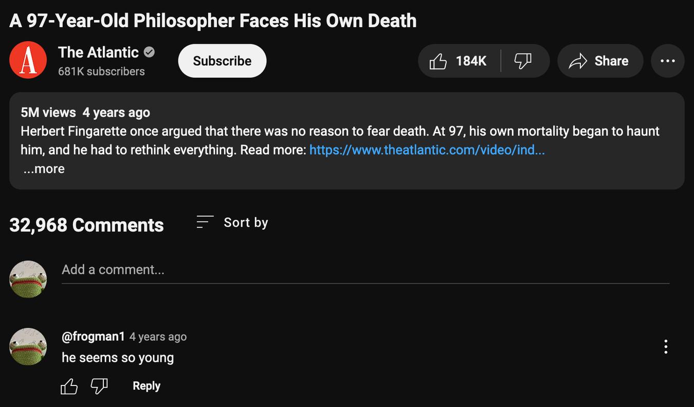

promising, at 3am in a bar with a friend, that "i'm going to have everything figured out by the time i'm thirty." but i'm already going on twenty-two, and my parents are in their fifties, and it's plain to see that they haven't figured everything out. maybe i'll manage it—maybe i'll be the singular, total scholar of my own mind, body, and soul. i once watched a video by a philosopher who was a hundred years old, who was still scared to die, who had been thinking about this shit his whole life and still hadn't come up with a satisfying conclusion. i'm getting something wrong about life, but i can't really figure out what that is. it seems nobody can. it seems everybody, even the existential philosopher, is too busy living.