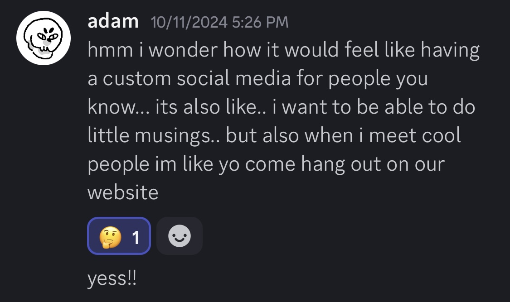

# hi. welcome to untitled social :)

below is a little background about the creation of this website

(post break)

i made this over the course of about a month, based on conversations i've had with adam about social media.

![Screenshot of a DM. I'm messaging my friend Adam. I link the website 'letterclub.games' and say, 'here is a cool blog run by several people that talk about games in the format of letters that they write to one another, and they respond to the letters in new posts with backlinks that make it so that you can track a conversation back to the very beginning. so like for simplicitys sake and also as a way of facilitating more meaningful comments, what if reply posts instead of comments... i'm thinking out loud.' Adam replies, 'i think it would be so sick if it was something only friends used. and then we can post about little things but also like: who wants to go get a picnic?' I respond, 'damn should i make this right now?'](YOg3hd3y-11-19-2024-IMG_8350.jpeg)

i got the idea for the name from that burger spot "untitled burger". i like how it makes this website sound like it's barely a social media. that's exactly what it is: barebones.

# what is "untitled social" for?

i like hanging out with my friends (you guys) in real life. i also still really like social media, even though i'm pretty disillusioned by most social media these days. i like the conversation, that it can be a place to put random noncommittal thoughts or a shared memory archive.

i was into cohost for a while, which was a social media that was intentionally designed to not show numbers—likes, follower counts, etc—which made it feel like old forums i used to frequent online, quiet and maybe even a bit unengaging. but in the end, more human for it. unfortunately, cohost shut down recently, so that left me wanting.

adam had the idea that this website shouldn't replace but *facilitate* our offline interaction. so i think it would be nice to use this website to...

- post photos after a hangout
- share an article you want to talk about later
- record the wins and losses of a board game sesh
- review a movie after movie night
- share lyrics or musical ideas to jam to later
- summarize or reflect on a good conversation
- post details for an upcoming event that might be interested in
- share art

or post random things. part of the reason i made this website is because i hate scrolling through twitter slop but i don't have anything better to aimlessly scroll when i'm on the toilet :)

anyway, i had a lot of fun making this. hope you can have fun with it as well!
